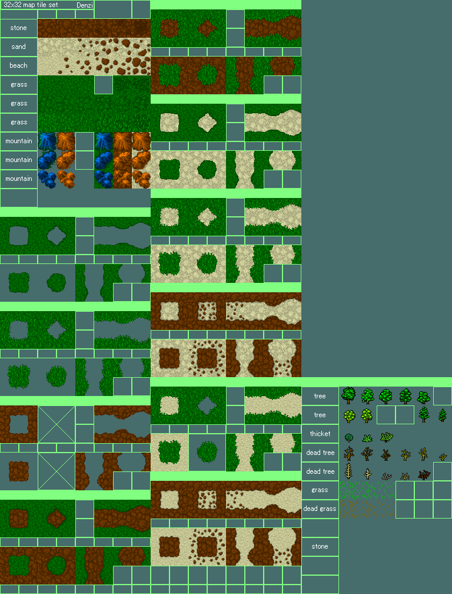

# RogueTiles

A small python library meant for command-line work on tiles for games in general and roguelikes in particular.

## Use Cases

## First use-case
The first use-case is to retrieve one or more tiles from one or more files and place into a new tile file.  This is meant to be scriptable so the target tile file can be re-generated at any point.  Example:

### Original Tilesheet

### Sample conversion order
[Sample json-file with instructions](examples/sample-json.png)

### Resulting Tilesheet
[Resulting tilesheet](examples/tree.png)

## Second use-case
The second use-case is to extract single tiles into a single file, for later use/version control/etc.
